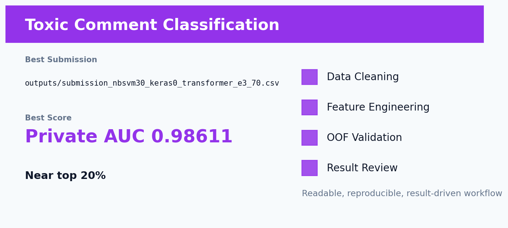

# Kaggle Jigsaw 有毒评论分类：传统 NLP 与 DistilBERT 的强互补融合



## 这个项目在简历里的定位

这是最适合展示 NLP 建模深度的项目之一：多标签分类、NB-SVM、Keras、DistilBERT、GPU kernel、融合权重搜索、无泄漏原则都包含了。

## 业务问题与评价指标

对评论同时预测 toxic、severe_toxic、obscene、threat、insult、identity_hate 等多个标签，指标为 mean ROC-AUC。业务上可用于社区内容审核和安全风控。

当前最佳为 `outputs/submission_nbsvm30_keras0_transformer_e3_70.csv`，Public AUC `0.98619`，Private AUC `0.98611`，接近 top 20%，且不使用 `test_labels.csv` 泄露。

## 我的整体解决思路

我把这个项目拆成五步：

1. **先理解数据**：看目标分布、字段类型、缺失模式、train/test 差异和指标特点。
2. **再做清洗**：把明显的脏值、哨兵值、语义缺失和泄露风险处理干净。
3. **重点做特征工程**：不是机械造列，而是把业务直觉、数据结构和模型能力连接起来。
4. **用 OOF 做验证**：每个模型都尽量通过交叉验证产生 OOF，避免只看一次线上提交。
5. **最后复盘取舍**：线上不涨的复杂方案不保留，最终只保留稳定、能解释、能复现的版本。

## EDA 与数据理解

- 有毒评论有大量拼写变体、规避写法和辱骂词组合，字符级特征非常重要。
- 多标签之间有关联，但每个标签的稀有程度不同，例如 threat、identity_hate 更难。
- 后竞赛数据里存在 test_labels，但使用它属于泄露，因此项目坚持合法方案。

## 数据清洗策略

- 轻度清洗换行、URL、HTML 实体，不破坏辱骂词和大小写模式。
- 每个标签独立训练和评估，最后取平均 AUC。
- 严格不使用 post-competition test labels，保证结果可用于真实简历展示。

## 特征工程：不是堆字段，而是写入业务逻辑

| 特征设计 | 为什么这样构造 | 预期收益 |
| --- | --- | --- |
| word TF-IDF | 常见有毒短语和词组有强信号。 | 捕捉直接辱骂表达。 |
| char TF-IDF | 用户会用拼写变体规避审核。 | 识别 ob5cene、i.d.i.o.t 等变体。 |
| NB-SVM log-count ratio | 有毒词在正负样本中的频率差异极强。 | 增强线性模型对毒性词的敏感度。 |
| DistilBERT E3 | 部分评论需要上下文判断，不能只看关键词。 | 补充语义理解能力。 |

这部分是整个项目最值得讲的地方。我的处理原则是：**先解释变量为什么可能影响目标，再决定把它做成比例、计数、交叉、分箱、rank、文本向量还是序列语义表示**。这样做出来的特征不是“玄学调参”，而是有业务含义、有验证闭环的建模资产。

## 模型选择：为什么用这些模型

- NB-SVM Logistic Regression 是强 sparse baseline，适合字符/词 ngram。
- Keras BiGRU-CNN 曾作为深度模型候选，但在强 Transformer 面前后期拖分。
- DistilBERT 训练 3 epoch 后 holdout AUC 显著提升。
- 最终选择 30% NB-SVM + 70% DistilBERT E3，主动移除 Keras，说明融合不是模型越多越好。

我没有把模型当成黑箱堆叠，而是根据数据形态选择模型：结构化数据优先树模型，类别特征多时重视 CatBoost，高维匿名数值用 LightGBM，文本任务则先用 TF-IDF 建强 baseline，再用 Transformer 补语义理解。

## 验证与防止过拟合

- 使用 OOF 或交叉验证观察本地泛化表现。
- 区分 public/private 分数，避免过度追逐单次 public leaderboard。
- 严格排除 ID、target、后竞赛标签等泄露来源。
- 对融合方案做线上复盘：如果复杂方案不涨分，就回退到更稳定版本。

## 运行结果分析

- 分数从 NB-SVM private `0.97937` 提升到 `0.98611`，核心提升来自更强 Transformer。
- Keras 在早期有互补作用，但后期被验证为拖分，及时放弃是项目的重要判断。
- 这个项目最能体现：既懂传统 NLP，也能跑深度学习，还能用实验结果做理性取舍。

## HR/面试官能看到什么能力

- **数据理解能力**：不是直接调包，而是先通过 EDA 找到数据里的结构和风险点。
- **特征工程能力**：能把业务问题翻译成模型可学习的变量。
- **模型选择能力**：知道什么时候用 CatBoost、LightGBM、XGBoost、线性模型或 Transformer。
- **实验复盘能力**：能解释为什么某个方案涨分，为什么某个方案被放弃。
- **工程整理能力**：保留最佳提交、实验日志、结果检查和 GitHub 展示文档。

## 如何复现

安装依赖：

```bash
pip install -r requirements.txt
```

复现时先从 Kaggle 下载原始数据到项目约定的数据目录。部分仓库为了保持轻量，只保留最佳提交文件、实验日志和核心说明；如果仓库中存在 `src/`、`notebooks/` 或 `kaggle_kernel_*`，优先从这些入口运行训练。

常见入口示例：

```bash
python src/train_best.py
# 或在 Kaggle 上运行 kaggle_kernel_* 中的 GPU kernel
```

如果当前项目只保留了最佳产物，可直接查看 `outputs/` 中的 OOF、prediction、submission 和实验摘要文件。

## 后续改进方向

- 训练 5-fold Transformer OOF，而不是单 holdout。
- 尝试 toxic-bert、RoBERTa、DeBERTa 等更强预训练模型。
- 提高 max_len 到 192/256，改善长评论截断。
